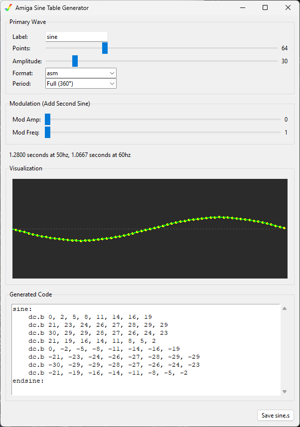

# Amiga Sine Generator

A Python-based tool to generate sine wave look-up tables (LUTs) for Amiga programming. It supports output for **Motorola 68000 Assembly**, **C/C++**, and **Blitz Basic**. This is a port of the [original Rust implementation](https://github.com/rdoetjes/sine_generator), enhanced with a GUI, multi-language support, and **advanced waveform generation** (Modulation, Period Control).



## Overview

This tool calculates sine wave values and outputs them as `dc.b` (Define Constant Byte) directives, ready to be included in your Amiga or other 68k assembly source code. It handles:

- **Amplitude scaling**: Adjust the height of the wave.
- **Step count**: Define the resolution of the table (number of points per period).
- **Advanced Waveforms**: Generate full waves, half-waves (positive/negative), or add modulation (secondary sine wave).
- **Visual preview**: Real-time graphical view of the waveform (GUI only).
- **Execution time estimation**: Estimates the time per frame at 50Hz (PAL) and 60Hz (NTSC) based on the number of points.

## Installation

Ensure you have Python 3.x installed. The tool uses standard libraries and `tkinter` for the GUI, so no additional `pip install` commands are typically required.

On linux, you may need to install `tkinter` separately:

debian based systems:

```bash
sudo apt-get install python3-tk
```

arch based systems:

```bash
sudo pacman -S tk
```

## Usage

### Graphical User Interface (GUI)

To use the GUI (default):

```bash
python sine_gen.py
```

**Features:**

- **ASM Label**: Set the label name for the table (e.g., `sine:`).
- **Points**: Slider to adjust the number of steps (0-255).
- **Amplitude**: Slider to adjust the magnitude (0-255).
- **Format**: Dropdown to select output format (**ASM**, **C**, **Blitz Basic**).
- **Period**: Dropdown to select generation mode:
  - **Full (360°)**: Standard full wave.
  - **Half (Positive)**: First 180° (0 to PI).
  - **Half (Negative)**: Second 180° (PI to 2PI).
- **Modulation**: Add a second sine wave on top of the primary one to create complex effects.
  - **Mod Amp**: Amplitude of the second wave.
  - **Mod Freq**: Frequency multiplier for the second wave.
- **Visualization**: Green dots on a dark background show the waveform.
  - *Note*: The visualization uses screen coordinates where positive values (down) correspond to increasing memory addresses/screen lines, matching typical copper list or sprite y-positioning logic.
- **Real-time Code**: The generated assembly code updates instantly in the text box.
- **Execution Time**: Displays the theoretical execution time for the given number of points at 50Hz and 60Hz.
- **Save**: Export the code to a `.s` file.

### Command Line Interface (CLI)

To use the CLI for batch processing or scripting, add the `--cli` flag:

```bash
python sine_gen.py --cli [options]
```

**Arguments:**

- `--cli`: **Required** to run in CLI mode.
- `--label`: ASM label name (default: `sine`).
- `--points`: Number of points (default: `50`).
- `--amplitude`: Amplitude of the wave (default: `80`).
- `--format`: Output format: `asm` (default), `c`, `blitz`.
- `--mod-amp`: Modulation amplitude (default: `0`).
- `--mod-freq`: Modulation frequency multiplier (default: `1`).
- `--period`: Generation period: `full` (default), `half`, `neg_half`.
- `--output`: Output filename (optional). If omitted, prints to stdout.

**Example:**
Generate a table with 128 points and amplitude of 50, saved to `wave.s`:

```bash
python sine_gen.py --cli --label wave --points 128 --amplitude 50 --output wave.s
```

## Output Format

The output is formatted for 68k assemblers (like VASM):

```asm
sine:
    dc.b 0, 3, 5, 8, 11, 13, 16, 18
    dc.b 20, 22, 24, 26, 27, 28, 29, 30
    ...
endsine:
```

**C/C++ Example:**

```c
signed char sine[] = {
    0, 3, 5, 8, 11, 13, 16, 18,
    20, 22, 24, 26, 27, 28, 29, 30
    ...
};
```

**Blitz Basic Example:**

```blitzbasic
.sine
    Data.b 0, 3, 5, 8, 11, 13, 16, 18
    Data.b 20, 22, 24, 26, 27, 28, 29, 30
    ...
```
